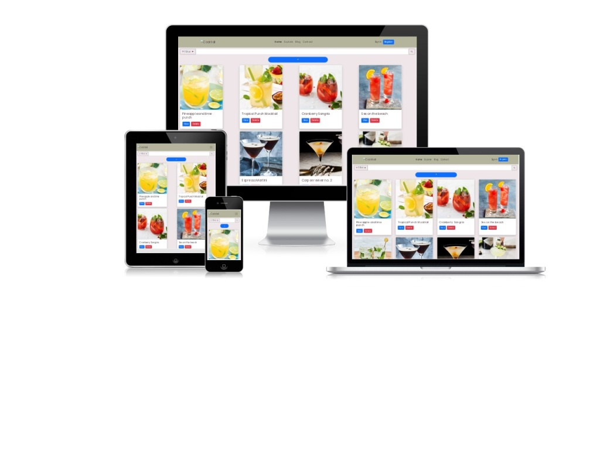

# Cocktail Central

Cocktail Central is a community-driven website that allows users to post, share, and discover cocktail recipes from all over the world. Users can create, review, and comment on a wide variety of cocktail recipes that include flavor profiles, ingredients, names, and preparation instructions.

To ensure a safe and enjoyable experience for all users, we have implemented user login and authentication. Our website also features a visually appealing design with a carefully chosen Colour scheme and adheres to the 5 planes of UI/UX design to provide a seamless user experience.

## Table of Contents

- [Features](#features)
- [Deployment](#deployment)
- [UI/UX Design](#uiux-design)
- [Limitations and Future Implementation](#limitations-and-future-implementation)
- [Testing](#testing)
- [Technologies Used](#technologies-used)
- [Credits and Acknowledgement](#credits-and-acknowledgement)

## Features

- **Cocktail Recipe Submission**: Users can submit their cocktail recipes, including flavor profiles, ingredients, names, and preparation instructions.
- **Search Functionality**: Users can search for specific cocktails or ingredients to discover new recipes.
- **Responsive Design**: The website is optimized for various devices and screen sizes to provide a consistent user experience across different platforms.
- **Colour Scheme**: The website features a visually appealing Colour scheme that complements the theme of cocktails and encourages user interaction.

## Deployment

- Frontend (React)
    - The frontend for this website was deployed using [Netlify](https://www.netlify.com/)
    - The live link for this website can be found [here](https://isaactg02.netlify.app/)

- Backend (Express)
    - The backend for this website was deployed using [Render](https://render.com/)
    - The API for this website can be found [here](https://github.com/isaaccjh/sianalr)

## UI/UX Design

Our website adheres to the 5 planes of UI/UX design, which include Strategy, Scope, Structure, Skeleton, and Surface, to ensure an optimal user experience.

### **Strategy**

The website's main goal is to create a platform for users to share and discover cocktail recipes, fostering a sense of community among cocktail enthusiasts.

### **Scope**

The goal of the website is simple - to allow people from all over the world to find cocktail recipes, as well as connect with fellow Cocktail enthusiasts.
To achieve the website's goal, we have implemented features such as recipe submission and a search functionality that allows users to find recipes based on it's name, ingredient, drink type, and flavour profile. We plan on implementing more features, such as user registration and login, reviews, and comments in the near future.

### **Structure**

The Cocktail Central website is designed as a single-page application to provide users with a seamless and user-friendly experience. All features, including creating, deleting, editing, and viewing recipes, are integrated onto a single page for convenience. This means that users can access all of the app's features without navigating to different pages, making it easy to find and use the tools they need to create and share cocktail recipes.

### **Skeleton**

- Interface Design
    - The user interface of Cocktail Central is designed to be visually appealing and easy to use. The app's single-page design ensures that all features are easily accessible from any point, and the navigation menu and search bar are prominent and easy to find. The overall layout is clean and uncluttered, with ample white space and clear visual hierarchy. The design of the recipe pages is also carefully considered, with a clear and intuitive layout that highlights the most important information. Ingredients, preparation instructions, and user reviews and comments (to be implemented) are organized into separate sections, making it easy for users to find the information they need.

- Navigation Design
    - Navigation in Cocktail Central is designed to be intuitive and user-friendly. The navigation menu is prominently displayed at the top of the page and provides easy access to all the app's features. The menu includes links to create, edit, and view recipes, as well as a search bar to help users find specific recipes or ingredients. In addition, the navigation menu will soon include options for user authentication, such as login and registration, as well as links to the user's profile and settings. The menu design is consistent throughout the app, providing a seamless user experience.

- Information Design
    - Cocktail Central's information design is focused on making it easy for users to find and use the app's features. Recipe pages are designed with a clear and intuitive layout that highlights the most important information, such as ingredients and preparation instructions. User reviews and comments are also displayed prominently, providing valuable feedback and suggestions for improvement. The search function is a key feature of Cocktail Central's information design, making it easy for users to find specific recipes or ingredients. Users can search by keyword, category, or filter by specific ingredients, allowing them to quickly find the recipes they need. Overall, Cocktail Central's information design is designed to be simple and intuitive, providing users with the tools they need to create, share, and discover new cocktail recipes.

### **Surface**

The visual design of the website, including the colour scheme, typography, and imagery, has been carefully chosen to create an engaging and enjoyable user experience. The Colours used are inspired by cocktails and their ingredients, evoking a sense of freshness and vibrancy. Overall, the font and colour choices in Cocktail Central are designed to be modern, clean, and visually appealing, while also providing a high level of readability and usability for users.

#### - Font

Cocktail Central uses the font Poppins throughout the app for a modern and clean look. The font is also highly readable, even at small sizes, which is important for users who may be browsing the site on mobile devices. 

#### - Colours

- Font
    - Cocktail Central uses the font Poppins throughout the app for a modern and clean look. The font is also highly readable, even at small sizes, which is important for users who may be browsing the site on mobile devices. 

- Colour

    -The primary colour is a bright orange colour that is often associated with energy and excitement, fitting for a website about cocktails. 

    -The secondary colour is a light green colour that conveys freshness and vibrancy, which aligns well with the fresh and lively nature of cocktails. 

    -The background colour is a light gray colour that provides a clean and neutral background, allowing the vibrant colours of the cocktails to stand out. This colour can also help reduce eye strain when users are browsing the app for an extended period of time.

| Colour             | Hex                                                                |
| ----------------- | ------------------------------------------------------------------ |
| Primary Colour |  #FF5722 |
| Secondary Colour |  #8BC34A |
| Background Colour |  #F2F2F2 |

The visual design of the website, including the colour scheme, typography, and imagery, has been carefully chosen to create an engaging and enjoyable user experience.

## Limitations and Future Implementation

- Future Implementations
    - User Authentication and registration
    - User Profile
    - User Comments and reviews
    - Save and like function 
    - Filters will be improved to filter save and like function
    - Allow users to create ingredients
- Limitations
    - Limited in the number of ingredients because I wanted to give each ingredient it's own ID

## Testing

| Test Case Description | Expected Result |
| ---------------------| ------------------ |
| **Posting a cocktail recipe** | |
| Post a cocktail recipe with all required fields | Recipe is successfully added to the website |
| Post a cocktail recipe without a name | Recipe is not added and user is prompted to enter a name |
| Post a cocktail recipe without any ingredients | Recipe is not added |
| Post a cocktail recipe with an invalid image URL | Recipe is not added |
| **Deleting a cocktail recipe** | |
| Delete a cocktail recipe | Recipe is removed from the website |
| **Editing a cocktail recipe** | |
| Begin edit of an existing cocktail recipe | Recipe is displayed correctly. Ingredients is not displayed and preparation instructions text area is disabled |
| Edit the name of an existing cocktail recipe | Recipe name is updated and displayed correctly |
| Edit the glass type of an existing cocktail recipe | Recipe glass type is updated and displayed correctly |
| **Filtering search results** | |
| Search for cocktails with a specific ingredient | All cocktails with the ingredient are displayed |
| Search for cocktails with a specific flavour profile | All cocktails with the flavour profile are displayed |
| Filter search results to show only cocktails or mocktails | Only the selected type of recipe is displayed |
| Filter search results to show only cocktails served in a specific type of glass | Only the selected type of glass is displayed |

## Technologies Used

### Backend

- Javascript
    - Main language in building the backend server.
    - With this language, handled many of the information processing.

- Nodemon
    - Used in the development of this web application by automatically restarting the node application when changes are detected

- [Express](https://expressjs.com/)
    - Used the Express framework for the handling of HTTP requests

- [MongoDB](https://www.mongodb.com/)
    - Used to store data for website
    - Used MongoDB's database language to query for items that are being stored in the database

- [MongoDB Node Driver](https://www.mongodb.com/docs/drivers/node/current/)

   - To communicate with MongoDB database

- [cors](https://www.npmjs.com/package/cors)

   - Middleware to enable Cross-Origin Resource Sharing (CORS)

- [dotenv](https://www.npmjs.com/package/dotenv)

   - To allow loading of environment variables from .env file

### Frontend

- HTML
    - Used along with React to build the skeleton of the website

- CSS
    - Applied different CSS Styles for added personal touch

- Javascript
    - Main language used to handle all information for the website.
    - Used it in customising UI/UX. Applied functions in enhancing the UI/UX
- [React](https://reactjs.org/)
    - Framework for the frontend of the website. Used it's components to handle mainly the rendering of the website

- [Bootstrap 5](https://getbootstrap.com/docs/5.0/getting-started/introduction/)

   - Used for styling website and it's components

- [React Bootstrap](https://react-bootstrap.github.io/)

   - Used for styling website, along with bootstrap to make up for majority of the website styling

- [Axios](https://github.com/axios/axios)

   - Used to communicate with Express server to update data in the database

- [Google Fonts](https://fonts.google.com/)

   - For "Poppins" font that is usedi n website

- [React Icons](https://react-icons.github.io/react-icons)

    - Used for icons displayed in website

## Credits and Acknowledgement

- [ChatGPT](https://chat.openai.com/chat)
    - Used for help with information and typing
    - Also helped with some of the debugging
- [CreateMockup](https://www.mediageni.com/responsive-website-check/)
    - Used in creating mockup
- [Doris](https://github.com/DS-NASA-61)
    - Referred to her completed README.md